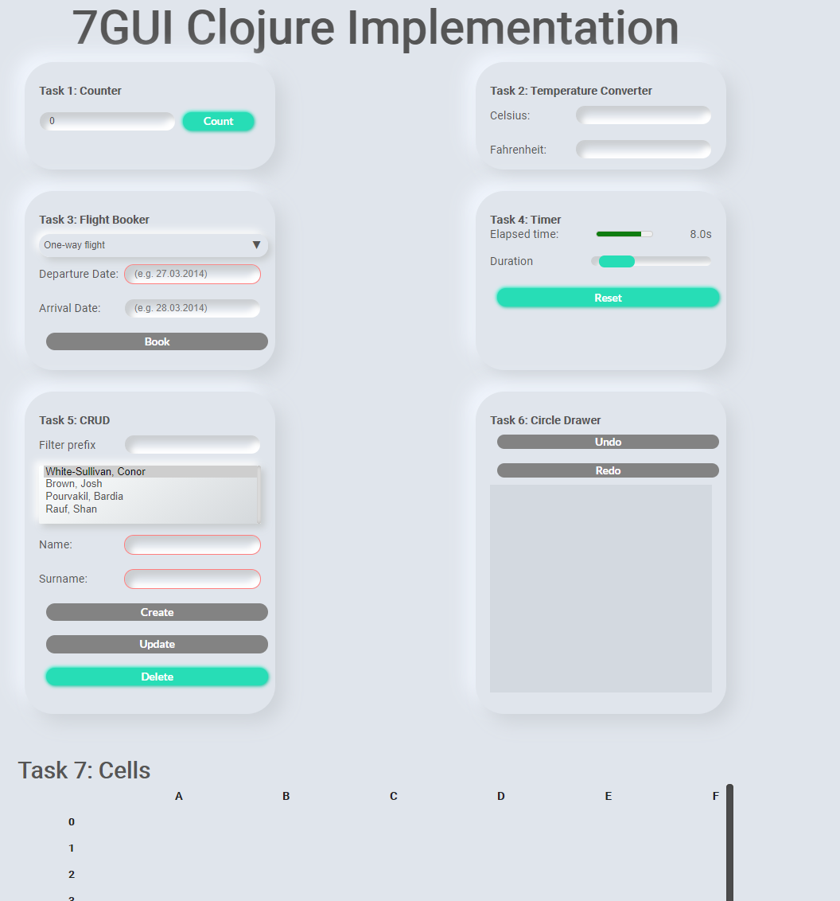

# 7gui-clojure

My implementation of 7GUI in Clojure (live demo [here](https://friendly-lamport-37fe13.netlify.app/))

# Cells

- Strictly follows behavior of 7GUI spec AND Excel
- Easily modify column/row counts, add operations, create new expression syntax, etc

## Operations

- Syntax: `=FORMULA(input1 input2 inputX)`

### Math Operators
- Add - SUM
- Subtract - SUB
- Divide - DIV
- Multiply - MUL
- Modulo - MOD
- Minimum - MIN
- Maximum - MAX
- Round - ROUND
- Count - COUNT
- Counta - COUNTA
- Average - AVG

### Logical Operators
- If - IF
- Or - OR
- And - AND
- Equal - EQUAL
- Not - NOT

## Keyboard Shortcuts
- Tab/Arrow keys to move around
- Ctrl + Home/End to move to first/last cell in sheet
- Enter to enter/exit a cell
- Escape to exit cell & discard changes
- Space to start editting a cell
- Type anything to override cell with what you typed
- Backspace/Delete to clear a cell

# Setup

Install Clojure and Leiningen

## Development
Run `lein fig:build` and open http://localhost:9500/

## Production
Switch to `site` branch, run `lein fig:prod`,  move resources/public files into target/public, and commit changes (Netlify auto-deploys)